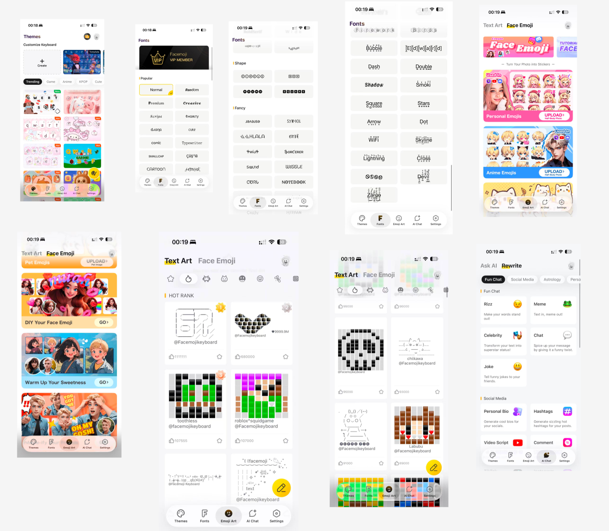

# Facemoji AI Agent — Product Strategy Case Study

> Transforming Facemoji Keyboard from an emoji keyboard into an AI-powered communication copilot.

**[View the Live Case Study →](https://facemoji-agent.vercel.app/deck.html)**&nbsp;&nbsp;|&nbsp;&nbsp;**[Try the Interactive Prototype →](https://facemoji-agent.vercel.app/prototype.html)**

---

## Overview

Facemoji is one of the largest expression-first keyboards globally, with **550M+ downloads** across **170+ countries** and a ranking of **#9 on a16z's Top 50 GenAI Mobile Apps (2024)**. This case study proposes evolving Facemoji from a customization-driven emoji keyboard into an **AI Agent for expressive communication** — helping users decide *how* to react, respond, and express tone, directly inside the keyboard.

The full deck covers market research, competitive analysis, product vision, monetization strategy, U.S. GTM playbook, and technical architecture.

---

## What's Inside

### 1. Market & User Research
- Analysis of hundreds of Facemoji app store reviews across pain points (reliability, control, typing quality, ad friction)
- ICP demographic breakdown: **79% of users are under 35**, skewing heavily Gen Z (18–24: 51%)
- Behavioral data on emoji usage: 10B+ emojis sent daily, 92% of internet users use emojis

### 2. Competitive Landscape
- Three-category market map: System Keyboards (Gboard, SwiftKey), Expression Keyboards (Facemoji, Kika, Bobble), AI Writing Keyboards (Grammarly, CleverType)
- Interactive 2×2 positioning chart showing the **whitespace opportunity** in AI + Expressive Communication
- Virtual keyboard market sizing: $1.1B (2022) → $2B projected by 2032



### 3. Market Insight
- Debunks three fragile industry assumptions: customization = retention, ads sustain free models, emoji novelty drives growth
- Each assumption backed by sourced evidence from app store data, Grammarly's financials, and Emojipedia research

### 4. Product Vision — 6 AI Agent Features
| Feature | Description |
|---------|-------------|
| **React** | Context-aware emoji, GIF, sticker, and meme-style reply suggestions |
| **Reply** | Smart replies, message summaries, tone rewrite, real-time translation (150+ languages) |
| **Create** | Captions, hashtags, meme text, text-art, AI-generated sticker/emoji packs |
| **Act** | In-keyboard search, planning, recommendations, and next-step prompts |
| **Voice AI** | Voice-to-text with tone detection, voice-triggered AI commands, speech-to-emoji |
| **Social Twin** | AI learns your personal slang, emoji patterns, and tone to generate replies that sound like *you* |

### 5. Monetization Playbook
Three validated revenue paths with real-world comparables:
- **Freemium AI Subscription** — Grammarly model (40M DAU, ~$700M revenue, $13B+ valuation)
- **Creator Marketplace** — LINE model ($75M sticker sales in Year 1, 390K → 4M creators)
- **AI Content Generation Upsell** — Premium meme generators, avatar tools, caption tools

### 6. U.S. GTM Playbook
- **Channel strategy**: TikTok (89 min/day avg), Instagram (52.4M Gen Z users), Snapchat (453M DAU)
- **Comparable case studies**: Bitmoji × Snapchat (#1 iOS app 2017), Duolingo's TikTok strategy (37M → 116.7M MAU)
- **Phased rollout**: Seed (AI-native shareable content) → Grow (viral loops) → Monetize (subscription + creator marketplace)
- **Viral mechanics**: The output *is* the marketing — every shared meme reply, caption, or sticker carries distribution

### 7. Technical Architecture


Lightweight multi-agent system with 6 layers:
1. **Conversation Context** — Captures messages, detects language & tone from messaging apps
2. **Context Analyzer** — Real-time conversation snapshot for downstream decisions
3. **Intent Detection** — Classifies intent (summarize, reply, translate, plan) and routes to agents
4. **Agent Orchestrator** — Specialized agents: Reaction, Conversation, Action, Creation, Social Twin
5. **AI Models** — LLM (generation/summarization), Multimodal AI (images/stickers), Ranking Model, Voice Stack
6. **Suggestion Layer & Keyboard UI** — Quick replies, emoji strip, action cards; on-device for speed, cloud for heavy generation

---

## Project Structure

```
├── deck.html            # Full case study deck (single-file HTML/CSS/JS)
├── prototype.html       # Interactive phone prototype demo
├── slide 8.png          # Technical architecture diagram
├── Figmav1.png          # Figma design v1
├── Figmav2.png          # Figma design v2
├── image copy.png       # Prototype screenshot — Themes
├── image copy 2.png     # Prototype screenshot — Fonts
├── image copy 3.png     # Prototype screenshot — Emoji Art
├── *.jpg                # Product screenshots (themes, fonts, text art, stickers, AI chat)
├── Product              # Product research notes
├── Prototype            # Prototype research notes
├── Reviews              # App store review analysis
├── Slides V2            # Slide content v2
├── slides v3            # Slide content v3 (final)
└── README.md
```

---

## Tech Stack

- **Frontend**: Single-file HTML/CSS/JS — no build tools, no frameworks
- **Typography**: DM Serif Display (headings) + Inter (body)
- **Charts**: SVG-based competitive positioning map, animated bar charts with scroll-triggered JS
- **Design System**: CSS custom properties, 3-tier container system (720px / 880px / 1080px)
- **Hosting**: Vercel
- **Design**: Figma

---

## Live Links

| Link | URL |
|------|-----|
| Case Study Deck | [facemoji-agent.vercel.app/deck.html](https://facemoji-agent.vercel.app/deck.html) |
| Interactive Prototype | [facemoji-agent.vercel.app/prototype.html](https://facemoji-agent.vercel.app/prototype.html) |
| Vercel Dashboard | [vercel.com/amys-projects-d3dfb125/facemoji-agent](https://vercel.com/amys-projects-d3dfb125/facemoji-agent) |

---

## Author

**Amy Zhuang** — Product Strategy & Vision

- Portfolio: [amyzhuang.me](https://www.amyzhuang.me)
- GitHub: [@amyzhuang111](https://github.com/amyzhuang111)
